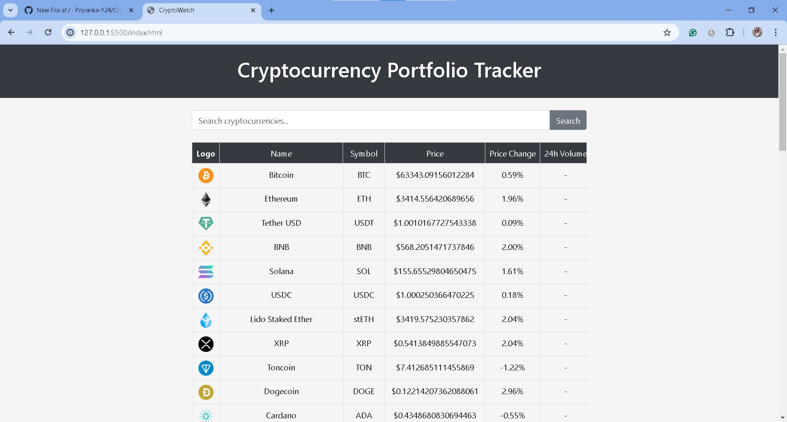
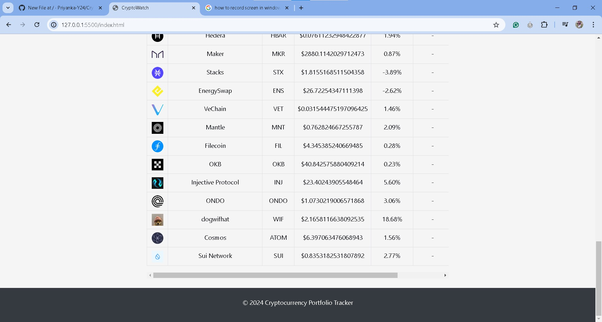
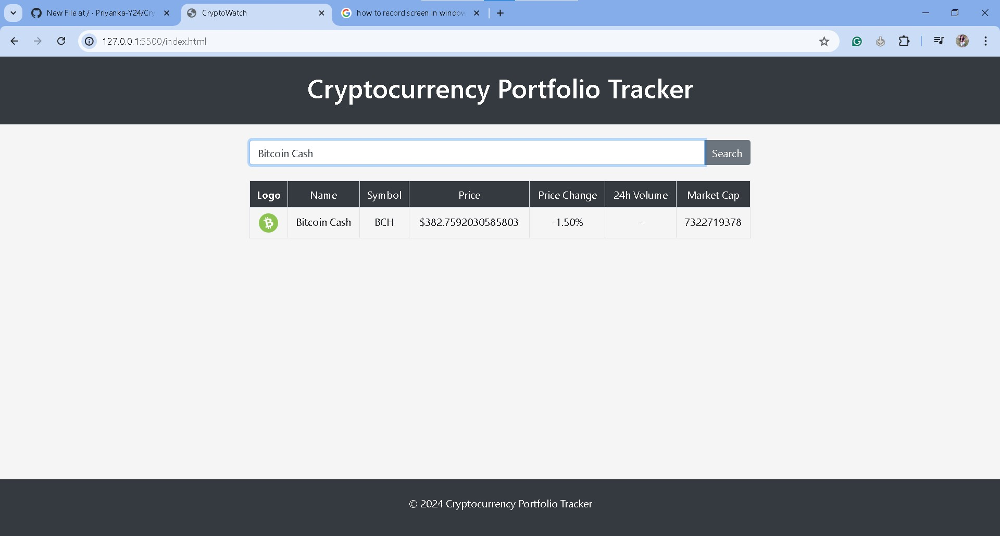

# CryptoWatch

CryptoWatch is a web-based Cryptocurrency Portfolio Tracker built with JavaScript, HTML, and CSS. This application provides real-time updates on cryptocurrency data using the CoinRanking API. Users can add and manage transactions, including details like name, symbol, price, and quantity. The interface is designed to be interactive and user-friendly.

## Features

- Real-time cryptocurrency data updates using the CoinRanking API
- Add and manage transactions with details like name, symbol, price, and quantity
- Interactive and user-friendly interface

## Technologies Used

- JavaScript
- HTML
- CSS
- CoinRanking API

## Getting Started

To get a local copy up and running, follow these simple steps.

### Prerequisites
A web browser.

## Screenshots

